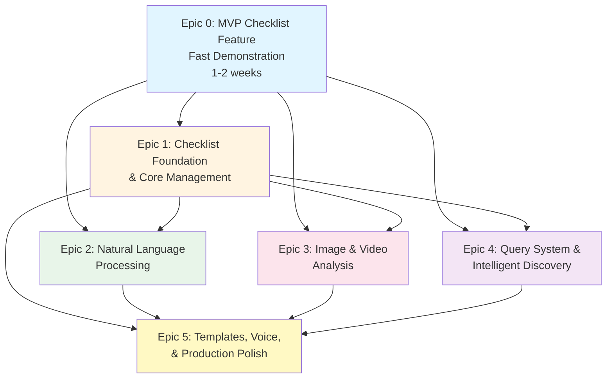

# communexus Product Requirements Document (PRD)

**Author:** BMad
**Date:** 2025-01-02
**Project Level:** 3
**Target Scale:** Enterprise

---

## Goals and Background Context

### Goals

- Enable contractors to create and manage structured checklists linked to projects/threads for task tracking and completion verification
- Automate checklist updates through natural language processing, allowing users to update items via voice or text commands without manual UI interaction
- Automatically detect task completion from photos and videos using AI vision analysis, reducing manual checklist management overhead
- Provide intelligent query system to identify next uncompleted tasks and answer natural language questions about checklist status
- Leverage existing AI infrastructure, action items system, and media handling to minimize development time and maximize feature delivery speed

### Background Context

Communexus currently has a robust foundation for implementing checklist functionality: a working action items system that extracts tasks from conversations, comprehensive AI infrastructure with OpenAI GPT-4 integration, media upload capabilities for images and videos, and a project/thread organization system. The PRD-Checklist-Feature-Analysis.md identifies that 37.5% of requirements are already met, with 25% partially met, requiring primarily checklist-specific data models, NLP intent recognition, and vision analysis capabilities.

This PRD focuses on the fastest path to full checklist functionality by building directly on existing systems rather than creating parallel implementations. The approach leverages the current action items infrastructure as a foundation, extends the AI service layer for checklist-specific NLP and vision analysis, and integrates checklist management into the existing thread/project UI patterns. This strategy reduces development time from the estimated 10.5-15 weeks to approximately 6-8 weeks by maximizing reuse of existing components.

---

## Requirements

### Functional Requirements

**Checklist Management**

- FR001: Users can create checklists linked to projects/threads with title, description, and optional template selection
- FR002: Users can add, edit, reorder, and delete checklist items with title, description, optional due date, and priority
- FR003: Users can mark checklist items as pending, in-progress, or completed with timestamp and user attribution
- FR004: Checklists support hierarchical organization with sections/categories for grouping related items
- FR005: Users can duplicate checklists and convert existing action items to checklist items
- FR006: Checklist items can have media attachments (photos, videos) linked for completion verification

**Natural Language Processing for Checklists**

- FR007: System processes natural language commands to create, update, or query checklist items (e.g., "mark item 3 as complete", "add new task: install tiles")
- FR008: System recognizes intent from natural language (create item, update item, mark complete, query status, delete item)
- FR009: System matches natural language references to existing checklist items using semantic similarity and context
- FR010: System supports natural language queries about checklist status (e.g., "what's next?", "show me incomplete tasks", "how many items are done?")
- FR011: System provides confirmation and preview before applying NLP-driven checklist updates
- FR012: System supports multi-language natural language processing for checklist operations (English, Spanish, French as initial languages)

**Image and Video Analysis**

- FR013: System analyzes uploaded images to detect checklist item completion status using GPT-4 Vision API
- FR014: System analyzes video content (via frame extraction) to verify task completion
- FR015: System automatically suggests checklist item updates based on image/video analysis with confidence scores
- FR016: System requires user confirmation before auto-updating checklist items from media analysis
- FR017: System links analyzed media to specific checklist items for audit trail
- FR018: System supports batch analysis of multiple images/videos for comprehensive task verification

**Query and Discovery System**

- FR019: System identifies next uncompleted checklist item based on priority, order, dependencies, and due dates
- FR020: System answers natural language queries about checklist status, progress, and completion rates
- FR021: System provides filtered views of checklist items (by status, priority, assignee, due date)
- FR022: System supports search across all checklists within a project or organization
- FR023: System generates checklist progress summaries and completion statistics

**Integration with Existing Systems**

- FR024: Checklists integrate seamlessly with existing thread/project organization system
- FR025: Checklists can be created from existing action items with one-click conversion
- FR026: Checklist items can trigger action item creation for downstream tasks
- FR027: Checklist completion events integrate with existing notification system
- FR028: Checklists appear in thread view sidebar alongside existing action items list

**User Interface**

- FR029: Checklist creation and editing UI integrated into thread view and project management screens
- FR030: Checklist items display with status indicators, media thumbnails, and completion timestamps
- FR031: Natural language input interface for checklist operations accessible via voice or text input
- FR032: Media analysis results display with confidence indicators and suggested actions
- FR033: Query interface provides instant answers and filtered checklist views

**Templates and Customization**

- FR034: System provides checklist templates based on project type (construction, maintenance, inspection, move-in, move-out)
- FR035: Users can create, save, and share custom checklist templates
- FR036: Templates support conditional items based on project properties (property type, size, etc.)
- FR037: System suggests relevant templates when creating new checklists based on project context

**Voice and Accessibility**

- FR038: System supports voice input for natural language checklist commands via speech-to-text
- FR039: System provides voice feedback confirming checklist updates (optional, can be disabled)
- FR040: System maintains accessibility standards for checklist UI components (screen reader support, keyboard navigation)

### Non-Functional Requirements

- NFR001: Checklist operations (create, update, query) must complete within 2 seconds for standard operations, 5 seconds for NLP processing, and 10 seconds for image/video analysis
- NFR002: System must support checklists with up to 200 items without performance degradation
- NFR003: Image/video analysis accuracy must achieve minimum 85% correct completion detection with user confirmation workflow for edge cases
- NFR004: Natural language intent recognition must achieve minimum 90% accuracy for common checklist operations
- NFR005: System must maintain checklist data consistency across concurrent updates from multiple users
- NFR006: Checklist data must be backed up and recoverable with same reliability as existing message/thread data
- NFR007: System must support offline checklist viewing and basic operations with sync when connection restored

---

## User Journeys

### Journey 1: Creating and Managing Checklists for a Construction Project

**Actor:** Contractor (Marcus)

**Goal:** Set up a comprehensive checklist for a bathroom renovation project and track progress through completion.

**Steps:**

1. [FR024, FR028] Marcus opens the Communexus app and navigates to the "Bathroom Renovation - 123 Main St" thread
2. [FR029] Marcus taps "Checklists" button in the thread header, then "Create New Checklist"
3. [FR034, FR037] System suggests "Bathroom Renovation" template based on thread context - Marcus selects it
4. [FR034, FR004] Template loads with 25 pre-configured items organized by phase (Demolition, Plumbing, Electrical, Tiling, Fixtures, Final Inspection)
5. [FR002] Marcus customizes items: adds "Install heated floor" to Electrical section, removes "Replace vanity" (not needed)
6. [FR002] Marcus sets due dates for critical path items and assigns priority levels
7. [FR001, FR024] Marcus saves checklist - it now appears in thread sidebar and is linked to the project
8. [FR003] As work progresses, Marcus checks off items: "Remove old tiles" → "Install new plumbing" → "Run electrical"
9. [FR006] Marcus takes photos of completed work and attaches them to relevant checklist items
10. [FR023] System shows progress: 18/25 items complete (72%) with visual progress bar
11. [FR019, FR020, FR033] Marcus queries "What's next?" - system highlights "Install shower fixtures" as next priority item
12. [FR003, FR023] Upon completion, Marcus marks final inspection items complete, system generates completion certificate

**Decision Points:**
- Use template vs. create from scratch (template saves time)
- Attach media now vs. later (immediate attachment provides better audit trail)
- Manual updates vs. NLP commands (NLP faster for simple operations)

**Edge Cases:**
- Template doesn't match project needs → create custom checklist [FR001, FR034]
- Need to add items mid-project → quick add via NLP [FR007, FR008] or UI [FR002]
- Multiple team members updating → system handles concurrent updates [NFR005]
- Checklist exceeds 200 items → system maintains performance [NFR002]
- Network connectivity issues → offline viewing supported [NFR007]
- Template conditional items don't apply → system skips irrelevant items [FR036]

---

### Journey 2: Natural Language Checklist Updates During Field Work

**Actor:** Field Technician (Sarah)

**Goal:** Update checklist items hands-free using voice commands while working on-site.

**Steps:**

1. [FR024, FR028] Sarah arrives at job site and opens property maintenance thread on mobile device
2. [FR029] Sarah opens the "Quarterly Maintenance Checklist" for the property
3. [FR030, FR023] Sarah sees 15 items, 8 completed, 7 remaining
4. [FR007, FR008, FR038] While inspecting HVAC system, Sarah speaks: "Mark HVAC inspection as complete"
5. [FR009, FR011] System processes voice input, matches to "HVAC System Inspection" item, shows preview: "Mark 'HVAC System Inspection' as complete?"
6. [FR003] Sarah confirms - item updates to completed status with timestamp
7. [FR007, FR008] Sarah continues: "Add new task: Replace air filter in unit 3B"
8. [FR002] System creates new checklist item "Replace air filter in unit 3B" with status pending
9. [FR007, FR006, FR038] Sarah completes the task, takes photo, then says: "Mark air filter replacement complete and attach this photo"
10. [FR009, FR003, FR017] System matches item, attaches photo, marks complete, links media
11. [FR010, FR020] Sarah asks: "What maintenance tasks are still pending?"
12. [FR020, FR021] System responds: "3 tasks remaining: Plumbing inspection, Electrical safety check, Fire extinguisher inspection"
13. [FR010, FR020] Sarah: "Show me the plumbing inspection details"
14. [FR030] System displays item details: description, due date, previous completion history
15. [FR007, FR038] Sarah completes plumbing inspection, uses voice: "Plumbing inspection done, all systems operational"
16. [FR003] System updates item, adds note "all systems operational" from voice transcript

**Decision Points:**
- Voice vs. text input (voice preferred for hands-free operation)
- Confirm vs. auto-apply (confirmation prevents errors)
- Detailed vs. brief commands (system handles both)

**Edge Cases:**
- Ambiguous item reference → system asks for clarification [FR009, FR011]
- Multiple items match → system shows options for selection [FR009, FR011]
- Network connectivity issues → commands queued for sync [NFR007]
- Voice recognition fails → system falls back to text input [FR038]
- Intent recognition fails → system requests clarification [FR008, NFR004]
- Multi-language input → system processes in user's language [FR012]
- Command timeout → system shows error and allows retry [NFR001]
- Low confidence match → system requires explicit confirmation [FR011]

---

### Journey 3: Automated Checklist Updates via Photo/Video Analysis

**Actor:** Property Manager (David)

**Goal:** Verify work completion and automatically update checklists using photo/video evidence.

**Steps:**

1. [FR027] David receives notification that contractor uploaded photos to "Kitchen Remodel - 456 Oak Ave" thread
2. [FR024, FR028] David opens thread, sees 5 new photos in message from contractor
3. [FR029, FR030, FR023] David opens "Kitchen Remodel Checklist" (12 items, 6 completed)
4. [FR032] David selects photos and chooses "Analyze for Checklist Completion" option
5. [FR013, FR015] System processes images using GPT-4 Vision:
   - Photo 1: Shows installed cabinets → matches "Install upper cabinets" item
   - Photo 2: Shows tiled backsplash → matches "Install backsplash tile" item
   - Photo 3: Shows installed countertop → matches "Install countertops" item
   - Photo 4: Shows sink and faucet → matches "Install sink and faucet" item
   - Photo 5: Shows completed kitchen overview → confirms overall progress
6. [FR015, FR032] System displays analysis results with confidence scores (92%, 88%, 95%, 90%, 85%)
7. [FR015, FR016] System suggests updates: "Mark 4 items as complete based on photo analysis?"
8. [FR032, FR017] David reviews suggestions, sees photo thumbnails linked to each item
9. [FR003, FR016, FR017] David approves updates - system marks items complete, links photos, adds analysis notes
10. [FR023, FR030] Checklist now shows 10/12 items complete (83% progress)
11. [FR010, FR020] David queries: "What's left to complete?"
12. [FR020, FR021] System responds: "2 items remaining: Install appliances, Final inspection and cleanup"
13. [FR014] Contractor later uploads video walkthrough of completed kitchen
14. [FR014, FR032] David selects video and "Analyze for Final Inspection"
15. [FR014, FR015] System extracts key frames, analyzes video content, detects appliances installed, suggests marking "Install appliances" complete
16. [FR003, FR016] David confirms - final item before inspection marked complete
17. [FR017, FR023] System generates completion report with all media evidence linked

**Decision Points:**
- Auto-apply vs. require confirmation (confirmation ensures accuracy)
- Single photo vs. batch analysis (batch more efficient)
- Image vs. video analysis (video provides more context)

**Edge Cases:**
- Low confidence scores (<80%) → system flags for manual review [FR015, FR016, NFR003]
- Photos don't match any checklist items → system suggests creating new items [FR013, FR015]
- Ambiguous visual evidence → system requests additional photos or clarification [FR013, FR016]
- Video analysis timeout → system processes in chunks or shows progress [FR014, NFR001]
- Batch analysis of 10+ images → system processes efficiently [FR018, NFR001]
- Media file too large → system compresses or rejects with error message [FR006, FR013]
- Analysis API failure → system shows error and allows manual marking [FR013, FR014]
- Multiple items detected in single photo → system suggests all matches [FR013, FR015]
- Media analysis accuracy below threshold → system requires manual confirmation [NFR003]

---

## UX Design Principles

1. **Speed and Efficiency First**: Checklist operations should be faster than manual note-taking. Natural language and voice input enable hands-free updates during field work.

2. **Confidence Through Confirmation**: All AI-driven updates (NLP commands, media analysis) require user confirmation with clear preview of changes before applying.

3. **Contextual Integration**: Checklists appear naturally within existing thread/project views, not as separate isolated features. Users shouldn't need to switch contexts.

4. **Progressive Disclosure**: Simple operations (mark complete) are one-tap, advanced features (templates, batch operations) are discoverable but not intrusive.

5. **Visual Evidence**: Media attachments and analysis results are prominently displayed, providing clear audit trail and verification of work completion.

---

## User Interface Design Goals

**Platform & Screens:**
- **Primary Platform**: React Native mobile app (iOS and Android)
- **Core Screens**: 
  - Thread view with integrated checklist sidebar
  - Checklist detail view (creation, editing, item management)
  - Media analysis results modal
  - Natural language input interface (voice/text)
  - Query results and filtered views

**Key Interaction Patterns:**
- **Checklist Access**: Button in thread header + sidebar panel (similar to existing action items)
- **Quick Actions**: Swipe gestures for mark complete, long-press for item options
- **Natural Language**: Floating action button for voice input, text input in message composer
- **Media Analysis**: "Analyze" button on photo/video messages, results shown in modal with approval workflow
- **Query Interface**: Search bar in checklist view with natural language support, instant results display

**Design Constraints:**
- Must match existing Communexus design system (colors, typography, component patterns)
- Reuse existing UI components where possible (ActionItemList patterns, modal components, input fields)
- Maintain consistency with thread/message UI patterns
- Support dark mode (if implemented in main app)
- Ensure accessibility: screen reader support, keyboard navigation, sufficient contrast ratios

---

## Epic List

- **Epic 0: MVP Checklist Feature - Fast Demonstration** (3 stories)
  - Goal: Deliver a working MVP that demonstrates all core checklist capabilities (creation, NLP updates, image analysis, queries) with minimal complexity for rapid validation
  - Target Timeline: 1-2 weeks

- **Epic 1: Checklist Foundation & Core Management** (3 stories)
  - Goal: Establish production-ready checklist data model, comprehensive CRUD operations, and polished UI components integrated with existing thread/project system

- **Epic 2: Natural Language Processing for Checklists** (3 stories)
  - Goal: Enable comprehensive natural language commands for all checklist operations with high accuracy and multi-language support

- **Epic 3: Image & Video Analysis for Automated Updates** (3 stories)
  - Goal: Implement comprehensive vision analysis for images and videos to automatically detect task completion and suggest checklist updates with high accuracy

- **Epic 4: Query System & Intelligent Discovery** (3 stories)
  - Goal: Build comprehensive natural language query interface and intelligent task discovery system leveraging existing smart search capabilities

- **Epic 5: Templates, Voice, & Production Polish** (3 stories)
  - Goal: Add checklist templates, complete voice support, multi-language UI, and final UX polish for production readiness

> **Note:** Detailed epic breakdown with full story specifications is available in [checklist-epics.md](./checklist-epics.md)
> 
> **File Naming Note:** The epic breakdown file is named `checklist-epics.md` (rather than `epics.md`) to distinguish it from other project epics. This naming convention is intentional and acceptable for validation purposes.

---

## Out of Scope

**Explicitly Excluded from This Release:**

- **Project Management Tool Integration**: Bidirectional sync with external PM tools (Asana, Trello, Monday.com) is deferred to future phase. Backend connector architecture exists but checklist-specific integrations are out of scope.

- **Advanced Dependencies & Workflows**: Complex checklist item dependencies, conditional logic, and automated workflow triggers are not included. Basic priority and ordering are supported.

- **Team Collaboration Features**: Assignment of checklist items to specific team members, team notifications, and collaborative editing are deferred. Checklists are project-scoped but not user-assigned in this release.

- **Checklist Analytics & Reporting**: Advanced analytics dashboards, completion trend analysis, and custom reporting are out of scope. Basic progress tracking and completion statistics are included.

- **Mobile-Only Features**: Web/desktop checklist management interfaces are excluded. This release focuses on mobile app experience.

- **Third-Party Integrations**: Direct integrations with construction management software, inspection apps, or specialized contractor tools are not included. Focus is on core checklist functionality within Communexus.

**Future Considerations:**
- Multi-user checklist collaboration and permissions
- Checklist versioning and history
- Advanced template marketplace
- Integration with calendar systems for due date management
- Export checklists to PDF/Excel formats
- Checklist sharing across organizations

---

## Traceability Matrix: Functional Requirements to Stories

This matrix maps each Functional Requirement (FR) to the specific epic(s) and story(ies) that implement it, ensuring complete coverage and traceability.

| FR ID | Requirement | Epic(s) | Story(ies) | Status |
|-------|-------------|---------|------------|--------|
| **Checklist Management** |
| FR001 | Create checklists linked to projects/threads | Epic 0, Epic 1 | 0.1, 1.1, 1.2 | Covered |
| FR002 | Add, edit, reorder, delete checklist items | Epic 0, Epic 1 | 0.1, 1.1, 1.2 | Covered |
| FR003 | Mark items as pending/in-progress/completed | Epic 0, Epic 1 | 0.1, 1.1, 1.2 | Covered |
| FR004 | Hierarchical organization with sections | Epic 1 | 1.1, 1.2 | Covered |
| FR005 | Duplicate checklists and convert action items | Epic 1 | 1.3 | Covered |
| FR006 | Media attachments (photos, videos) | Epic 0, Epic 1, Epic 3 | 0.3, 1.2, 3.2 | Covered |
| **Natural Language Processing** |
| FR007 | Process natural language commands | Epic 0, Epic 2 | 0.2, 2.1, 2.2 | Covered |
| FR008 | Recognize intent from natural language | Epic 0, Epic 2 | 0.2, 2.1, 2.2 | Covered |
| FR009 | Match natural language to items | Epic 0, Epic 2 | 0.2, 2.1 | Covered |
| FR010 | Natural language queries about status | Epic 0, Epic 2, Epic 4 | 0.3, 2.1, 4.1 | Covered |
| FR011 | Confirmation and preview for NLP updates | Epic 0, Epic 2 | 0.2, 2.1 | Covered |
| FR012 | Multi-language NLP support | Epic 2, Epic 5 | 2.2, 5.2 | Covered |
| **Image and Video Analysis** |
| FR013 | Analyze images for completion status | Epic 0, Epic 3 | 0.3, 3.1 | Covered |
| FR014 | Analyze video content for completion | Epic 3 | 3.2 | Covered |
| FR015 | Auto-suggest updates with confidence scores | Epic 0, Epic 3 | 0.3, 3.1, 3.2 | Covered |
| FR016 | Require user confirmation before auto-update | Epic 0, Epic 3 | 0.3, 3.1, 3.2 | Covered |
| FR017 | Link analyzed media to checklist items | Epic 0, Epic 3 | 0.3, 3.2 | Covered |
| FR018 | Batch analysis of multiple images/videos | Epic 3 | 3.1, 3.2 | Covered |
| **Query and Discovery System** |
| FR019 | Identify next uncompleted item | Epic 0, Epic 4 | 0.3, 4.1 | Covered |
| FR020 | Answer natural language queries | Epic 0, Epic 2, Epic 4 | 0.3, 2.1, 4.1 | Covered |
| FR021 | Filtered views of checklist items | Epic 4 | 4.2 | Covered |
| FR022 | Search across all checklists | Epic 4 | 4.2 | Covered |
| FR023 | Generate progress summaries and statistics | Epic 0, Epic 4 | 0.1, 4.3 | Covered |
| **Integration with Existing Systems** |
| FR024 | Integrate with thread/project system | Epic 0, Epic 1 | 0.1, 1.3 | Covered |
| FR025 | Create from existing action items | Epic 1 | 1.3 | Covered |
| FR026 | Trigger action item creation | Epic 1 | 1.3 | Covered |
| FR027 | Integrate with notification system | Epic 1 | 1.3 | Covered |
| FR028 | Appear in thread view sidebar | Epic 0, Epic 1 | 0.1, 1.2 | Covered |
| **User Interface** |
| FR029 | Checklist creation/editing UI | Epic 0, Epic 1 | 0.1, 1.2 | Covered |
| FR030 | Display items with status/media/timestamps | Epic 0, Epic 1 | 0.1, 1.2 | Covered |
| FR031 | Natural language input interface | Epic 0, Epic 2, Epic 5 | 0.2, 2.2, 5.2 | Covered |
| FR032 | Media analysis results display | Epic 0, Epic 3 | 0.3, 3.1, 3.2 | Covered |
| FR033 | Query interface with instant answers | Epic 0, Epic 4 | 0.3, 4.1, 4.2 | Covered |
| **Templates and Customization** |
| FR034 | Provide checklist templates | Epic 5 | 5.1 | Covered |
| FR035 | Create, save, share custom templates | Epic 5 | 5.1 | Covered |
| FR036 | Conditional items based on properties | Epic 5 | 5.1 | Covered |
| FR037 | Suggest templates based on context | Epic 5 | 5.1 | Covered |
| **Voice and Accessibility** |
| FR038 | Voice input for NLP commands | Epic 2, Epic 5 | 2.2, 5.2 | Covered |
| FR039 | Voice feedback confirming updates | Epic 2, Epic 5 | 2.2, 5.2 | Covered |
| FR040 | Accessibility standards (screen reader, keyboard) | Epic 1, Epic 5 | 1.2, 5.3 | Covered |

**Coverage Summary:** All 40 Functional Requirements are covered by one or more stories across the epic breakdown.

---

## Epic Dependency Diagram

The following diagram illustrates the dependencies between epics and their sequencing for implementation:

**Dependency Explanation:**
- **Epic 0 (MVP)** is the foundation - delivers working demonstration of all core capabilities
- **Epic 1** builds production-ready foundation on MVP base
- **Epics 2, 3, 4** can be developed in parallel after Epic 1, as they extend different capabilities
- **Epic 5** depends on all previous epics for production polish and advanced features

**Implementation Sequencing:**
1. **Phase 1:** Epic 0 (MVP) - Rapid validation
2. **Phase 2:** Epic 1 (Foundation) - Production infrastructure
3. **Phase 3:** Epics 2, 3, 4 (Parallel development) - Core feature expansion
4. **Phase 4:** Epic 5 (Polish) - Production readiness

---

